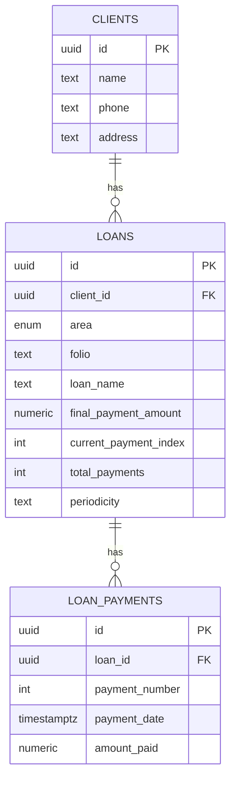

# Sistema Administrativo de Vales y Prestamos

Aplicacion web para gestionar clientes, prestamos y pagos en dos modulos: Vales (quincenal) y Banco (mensual).
Construida con React + Vite + Tailwind CSS.

## Caracteristicas actuales

- Gestion de clientes en modulo Vales (nombre, telefono y domicilio).
- Alta de prestamos por fuente con folio unico.
- Tabuladores por fuente y calculo de pago por quincena.
- Registro de pago individual con monto fijo por quincena (boton Registrar).
- Confirmacion modal antes de registrar cada pago.
- Edicion de fecha de pago y fecha de creacion del prestamo.
- Estado de cuenta con columnas:
  - Fecha de pago
  - Num. de pago
  - Saldo anterior
  - Importe de pago
  - Nuevo saldo
- Resumen por fuente y total general.
- Modulo Banco con:
  - Cliente nuevo por defecto o seleccion de cliente existente de Vales.
  - Prestamos identificados por nombre (sin folio).
  - Registro de pagos mensuales manuales por prestamo.
  - Estado de cuenta por prestamo con fecha, num. de pago, saldo anterior, importe y nuevo saldo.

## Regla de quincena usada (Vales)

El proyecto usa una regla unica:

- `currentPayment` = cantidad de pagos ya registrados.
- Proxima quincena a pagar = `currentPayment + 1`.
- Prestamo completado cuando `currentPayment >= totalPayments`.

## Instalacion

### Requisitos

- Node.js 16+
- npm

### Pasos

1. Entrar al proyecto:

```bash
cd h:\vales
```

1. Instalar dependencias:

```bash
npm install
```

1. Ejecutar en desarrollo:

```bash
npm run dev
```

Abrir en `http://localhost:5173/`.

## Comandos

```bash
npm run dev
npm run build
npm run preview
npm run test
npm run test:watch
```

## Estructura principal

```text
vales/
├── src/
│   ├── components/
│   ├── constants/
│   ├── context/
│   ├── domain/
│   ├── pages/
│   ├── services/
│   └── lib/
├── docs/
├── supabase/
└── README.md
```

Notas de estructura:

1. `src/domain/vales` centraliza calculos y reglas de negocio de prestamos.
2. `src/services/vales` y `src/services/banco` separan integraciones por modulo.

## Estado de datos

- Actualmente el proyecto sigue trabajando con estado local.
- Los cambios se pierden al recargar.
- Ya existe preparacion para migracion a Supabase (documentada), pero no esta activa en runtime.

## Flujo actual Banco

1. Alta de cliente: modo principal crear cliente nuevo.
1. Alta de cliente (alterno): usar cliente existente de Vales con autocompletado de nombre, telefono y domicilio.
1. Alta de prestamo: nombre del prestamo, monto y plazo en meses.
1. Registro de pago: captura manual de fecha e importe por cada mes.
1. Busqueda de prestamos: por nombre del prestamo.

## Modelo recomendado (Vales + Banco)

Se usa un modelo compartido:

1. Un solo catalogo de clientes.
2. Prestamos separados por tipo de modulo (`vales` o `banco`).
3. Pagos siempre ligados a su prestamo.



Documentos relacionados:

- `docs/base-datos-supabase.md`
- `docs/especificacion-proyecto.md`

Cambios de tabulacion en Supabase:

1. El proceso para cambiar pagos por quincena y verificar impacto (sin alterar prestamos existentes) esta en `docs/base-datos-supabase.md`, seccion "Cambios de tabulacion en Supabase (produccion)".

## Soporte rapido

Si algo falla:

1. Elimina `node_modules`.
2. Ejecuta `npm install`.
3. Ejecuta `npm run dev`.

## Licencia

Uso privado.
