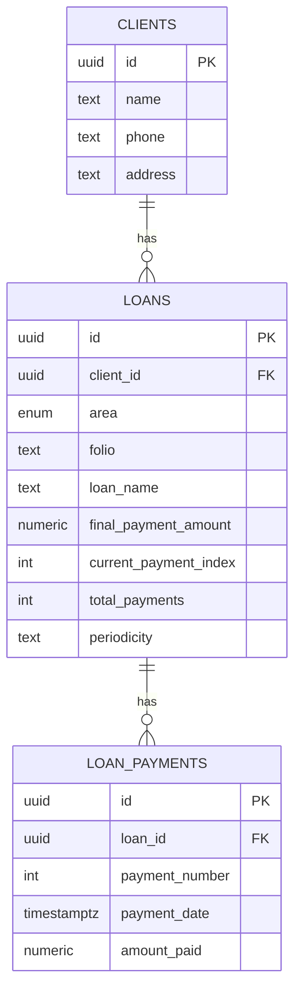

# Sistema Administrativo de Vales y Prestamos

Aplicacion web para gestionar clientes, prestamos y pagos en dos modulos: Vales (quincenal) y Banco (mensual).
Construida con React + Vite + Tailwind CSS.

## Caracteristicas actuales

- Gestion de clientes en modulo Vales (nombre, telefono, domicilio de casa y domicilio de trabajo opcional).
- Edicion de cliente en Vales y Banco (nombre, telefono, domicilio de casa y domicilio de trabajo).
- Alta de prestamos por fuente con folio unico.
- Tabuladores por fuente y calculo de pago por quincena.
- Registro de pago individual con monto fijo por quincena (boton Registrar).
- Confirmacion modal antes de registrar cada pago.
- Edicion de fecha de pago y fecha de creacion del prestamo.
- Estado de cuenta con columnas:
  - Fecha de pago
  - Num. de pago
  - Saldo anterior
  - Importe de pago
  - Nuevo saldo
- Resumen por fuente y total general.
- Modulo Banco con:
  - Cliente nuevo por defecto o seleccion de cliente existente de Vales.
  - Seguros y Prestamos como productos mensuales independientes de Vales.
  - Prestamos sin folio ni fuente, con monto total + plazo en meses.
  - Calculo automatico de pago mensual (`monto / meses`) y tabla de pagos por mes.
  - Registro de pago por mes con boton Registrar y estado `Falta por pagar`/`Pagado`.
- Modulo Gestion Personal con:
  - Servicios por periodicidad (mensual, bimestral, trimestral o personalizada).
  - Registro de pago por fecha y edicion de monto cuando el recibo varia.
  - Estado visual en Proxima Fecha: `Al corriente`, `Proximo`, `Vencido`.
- Modulo Configuracion con:
  - Centro de recordatorios (vencidos, para hoy y proximos) usando servicios personales.
  - Resumen operativo de cartera con falta por pagar en Vales y Banco.

## Regla de quincena usada (Vales)

El proyecto usa una regla unica:

- `currentPayment` = cantidad de pagos ya registrados.
- Proxima quincena a pagar = `currentPayment + 1`.
- Prestamo completado cuando `currentPayment >= totalPayments`.

## Instalacion

### Requisitos

- Node.js 16+
- npm

### Pasos

1. Entrar al proyecto:

```bash
cd h:\vales
```

1. Instalar dependencias:

```bash
npm install
```

1. Ejecutar en desarrollo:

```bash
npm run dev
```

Abrir en `http://localhost:5173/`.

## Comandos

```bash
npm run dev
npm run build
npm run preview
npm run test
npm run test:watch
npm run context:update
npm run context:watch
```

## Contexto compacto para IA

Existe un archivo maestro llamado `PROJECT_CONTEXT.md` pensado para analisis rapido por IA sin releer toda la carpeta.

- Generar o refrescar manualmente: `npm run context:update`
- Mantener actualizado en tiempo real mientras trabajas: `npm run context:watch`

El archivo conserva una seccion manual entre marcadores para agregar notas propias sin perderlas al regenerar.

## Estructura principal

```text
vales/
├── src/
│   ├── components/
│   ├── constants/
│   ├── context/
│   ├── domain/
│   ├── pages/
│   ├── services/
│   └── lib/
├── docs/
├── supabase/
└── README.md
```

Notas de estructura:

1. `src/domain/vales` centraliza calculos y reglas de negocio de prestamos.
2. `src/services/vales` y `src/services/banco` separan integraciones por modulo.

## Estado de datos

- El proyecto funciona en modo local por defecto (sin bloquear UI si no hay variables Supabase).
- Existe persistencia parcial opcional a Supabase para clientes (alta, edicion y eliminacion en Vales/Banco).
- Si Supabase no esta configurado o falla, esos flujos mantienen fallback local para pruebas.
- Aun no hay hidratacion inicial desde base de datos; por eso, los datos locales no persistidos se pierden al recargar.

## Flujo actual Banco

1. Alta de cliente: modo principal crear cliente nuevo.
1. Alta de cliente (alterno): usar cliente existente de Vales con autocompletado de nombre, telefono, domicilio de casa y domicilio de trabajo.
1. Edicion de cliente: actualizar telefono y domicilios cuando cambien.
1. Alta de prestamo: monto y plazo en meses (sin folio y sin fuente).
1. Alta de seguro: monto total y plazo en meses.
1. Registro de pago mensual por tabla (Mes 1..N) con boton Registrar.
1. Actualizacion automatica de pagado/restante y estado del producto.

## Flujo actual Gestion Personal

1. Alta de servicio con periodicidad y dia de pago.
1. Registro de pago con fecha exacta (sin desfase de dia por zona horaria).
1. Edicion de monto para servicios variables (ej. luz/internet).
1. Proxima Fecha se recalcula desde el ultimo pago y muestra estado visual.

Estados visuales:

- `Al corriente` (verde)
- `Proximo` (amarillo)
- `Vencido` (rojo)

## Modelo recomendado (Vales + Banco)

Se usa un modelo compartido:

1. Un solo catalogo de clientes.
2. Prestamos separados por tipo de modulo (`vales` o `banco`).
3. Pagos siempre ligados a su prestamo.
4. Servicios personales en tabla separada (`personal_services`) para conservar periodicidad y fechas ISO.



Documentos relacionados:

- `docs/base-datos-supabase.md`
- `docs/especificacion-proyecto.md`

## Configuracion operativa

La seccion Configuracion esta orientada a operacion diaria (no tecnica):

1. Centro de recordatorios para servicios personales en riesgo.
2. Ajustes de ventana y gracia de recordatorios.

Parametros:

- `upcomingWindowDays`
- `graceDays`

Nota: estos ajustes se guardan actualmente en `localStorage` (clave `vales_app_settings`) mientras la persistencia Supabase no esta activa.

Nota de alcance actual: la persistencia parcial activa en Supabase aplica a clientes. Prestamos/pagos y otros modulos siguen operando principalmente en estado local hasta completar la migracion total.

Cambios de tabulacion en Supabase:

1. El proceso para cambiar pagos por quincena y verificar impacto (sin alterar prestamos existentes) esta en `docs/base-datos-supabase.md`, seccion "Cambios de tabulacion en Supabase (produccion)".

Actualizacion de cliente en Supabase:

1. Funcion disponible: `public.update_client_profile(p_client_id, p_name, p_phone, p_address, p_work_address)`.
2. Solo actualiza clientes del usuario autenticado (`owner_id = auth.uid()`).

## Soporte rapido

Si algo falla:

1. Elimina `node_modules`.
2. Ejecuta `npm install`.
3. Ejecuta `npm run dev`.

## Licencia

Uso privado.

<!-- AUTO_SYNC_BLOCK:START -->
## Resumen Auto-Sync

Este bloque se actualiza automaticamente desde PROJECT_CONTEXT.md.

### NPM Scripts

- build: `vite build`
- context:update: `node scripts/sync-source-docs.mjs`
- context:watch: `node scripts/watch-project-context.mjs`
- dev: `vite`
- preview: `vite preview`
- test: `vitest run`
- test:watch: `vitest`

### Important Files Check

- README.md: present
- GUIA_INSTALACION.md: present
- INICIO_RAPIDO.md: present
- docs/especificacion-proyecto.md: present
- docs/base-datos-supabase.md: present
- supabase/schema.sql: present
- src/main.jsx: present
- src/App.jsx: present
- src/pages/ValesPage.jsx: present
- src/pages/BancoPage.jsx: present
- src/pages/ConfiguracionPage.jsx: present
- src/context/ClientsContext.jsx: present
- src/domain/personal/paymentDates.js: present
- package.json: present
- vite.config.js: present
- tailwind.config.js: present

### File Tree Snapshot

- docs/
  - base-datos-supabase.md
  - especificacion-proyecto.md
- scripts/
  - sync-source-docs.mjs
  - update-project-context.mjs
  - watch-project-context.mjs
- src/
  - components/
    - BancoClientForm.jsx
    - BancoInsuranceForm.jsx
    - BancoInsuranceTable.jsx
    - BancoLoanForm.jsx
    - ClientEditModal.jsx
    - ClientForm.jsx
    - ConfirmModal.jsx
    - LoanForm.jsx
    - LoansTable.jsx
    - PersonalServiceForm.jsx
    - PersonalServiceTable.jsx
    - Sidebar.jsx
  - constants/
    - tablesData.js
  - context/
    - ClientsContext.jsx
  - domain/
    - personal/
      - paymentDates.js
      - paymentDates.test.js
    - vales/
      - loanCalculations.js
      - loanCalculations.test.js
  - lib/
    - supabaseClient.js
  - pages/
    - BancoPage.jsx
    - ConfiguracionPage.jsx
    - PersonalPage.jsx
    - ValesPage.jsx
  - services/
    - banco/
      - index.js
    - vales/
      - index.js
    - valesSupabaseService.js
  - utils/
    - validators.js
  - App.jsx
  - index.css
  - main.jsx
- supabase/
  - schema.sql
- .gitignore
- GUIA_INSTALACION.md
- index.html
- INICIO_RAPIDO.md
- package-lock.json
- package.json
- postcss.config.js
- PROJECT_CONTEXT.md
- README.md
- tailwind.config.js
- vite.config.js

### SQL Snapshot (supabase/schema.sql)

- Tables:
  - app_user_settings
  - clients
  - loan_payments
  - loan_rate_change_log
  - loan_rate_tables
  - loan_source_settings
  - loans
  - personal_services
- Types:
  - app_area
  - insurance_mode
  - loan_product_type
  - loan_source_code
  - loan_status
  - payment_periodicity
- Functions:
  - get_loan_rate_change_history
  - save_app_user_settings
  - set_updated_at
  - sync_loan_owner_id
  - sync_payment_owner_id
  - update_client_profile
  - update_rate_for_new_loans
  - verify_rate_change_effect
<!-- AUTO_SYNC_BLOCK:END -->
