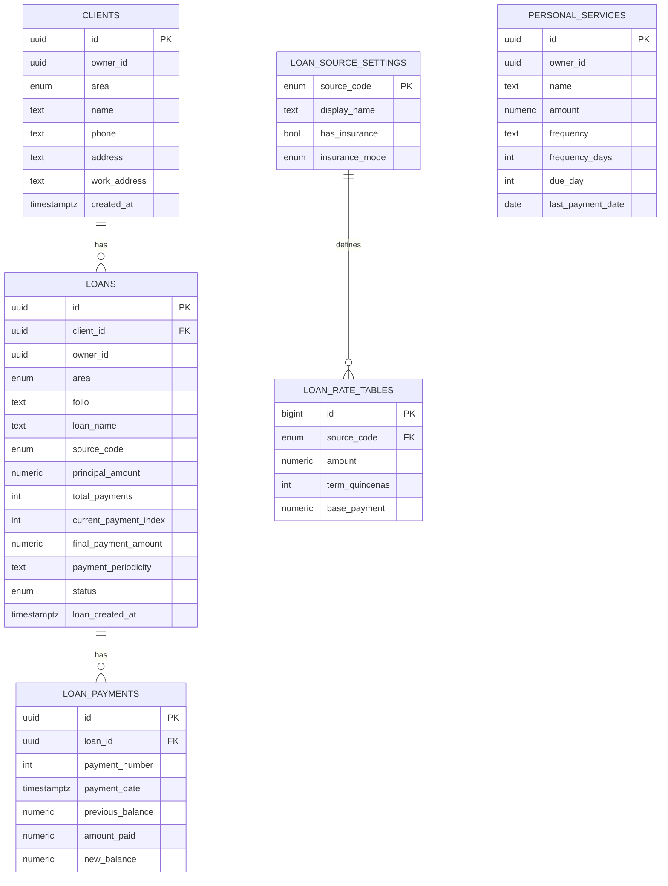

# Especificacion Detallada del Proyecto

## 1) Objetivo funcional

Sistema administrativo para:

- Gestion de clientes.
- Gestion de prestamos por fuente de cobro (VALES).
- Registro de pagos por quincena con control de saldo.
- Vista de resumen por fuente y total general.
- Modulo adicional BANCO con productos mensuales (seguros y prestamos) y tabla de pagos por mes.
- Modulo GESTION PERSONAL para servicios con periodicidad configurable.

## 2) Stack actual

- Frontend: React 18 + Vite.
- UI: Tailwind CSS + Lucide.
- Estado actual: local state con Context.
- Migracion objetivo: Supabase (Postgres + Auth + RLS).

## 3) Dominios y entidades

### VALES

- Cliente (`name`, `phone`, `address`, `workAddress?`).
- Cliente editable en UI (actualizacion de telefono y domicilios).
- Prestamo (`folio`, `source`, `amount`, `term`, `basePayment`, `insurance`, `finalPayment`, `status`).
- Pagos (`num`, `amount`, `date`) con estado de cuenta.

### BANCO

- Cliente banco (`name`, `phone`, `address`, `workAddress?`, `valesClientId?`).
- Cliente banco editable en UI (sin afectar historial de pagos/productos).
- Producto banco (`productType=loan|insurance`, `amount`, `termMonths`, `monthlyPayment`, `status`, `createdAt`).
- Pagos banco (`num`, `amount`, `date`) con tabla mensual por producto.

### GESTION PERSONAL

- Servicio (`name`, `amount`, `frequency`, `frequencyDays`, `dueDay`, `lastPaymentDate`).
- Registro de pago por fecha.
- Edicion de monto por variacion del recibo.
- Estado de proximo pago (`Al corriente`, `Proximo`, `Vencido`).

### CONFIGURACION OPERATIVA

- Centro de recordatorios para servicios personales en riesgo.
- Parametros de recordatorio:
  - `upcomingWindowDays`.
  - `graceDays`.

## 4) Reglas de negocio detectadas

1. Un folio debe ser unico en VALES.
1. Edicion de cliente modifica solo datos de contacto/domicilio; no altera historial de prestamos/pagos.
1. Cada fuente define montos/plazos validos por tabulador.
1. Seguro: `global` se divide entre quincenas y `perQuincena` se suma directo al pago.
1. Registro de pago individual en VALES: monto fijo por quincena con confirmacion previa.
1. Estado de cuenta: `saldo_anterior = total_a_pagar - suma_pagos_previos` y `nuevo_saldo = saldo_anterior - importe_pago`.
1. Al llegar al total de pagos, estado `completed`.
1. Regla de quincena unificada en VALES: `currentPayment` representa pagos ya registrados; la proxima quincena es `currentPayment + 1`; se completa cuando `currentPayment >= totalPayments`.
1. Regla Banco mensual: no usa folio ni fuente; el pago mensual se calcula como `monto / termMonths` y la tabla mensual controla pagos por mes.
1. Regla Gestion Personal: la proxima fecha se calcula desde `lastPaymentDate` cuando existe pago registrado; sin pago, se calcula desde el ciclo actual.

## 5) Riesgos a vigilar antes de migracion

1. Evitar reintroducir desfases de quincena al tocar flujos masivos.
2. Fechas almacenadas como texto local.
3. Dependencia de calculo en memoria (riesgo de incoherencia).
4. IDs locales no aptos para concurrencia multiusuario.
5. BANCO ya usa estructura mensual por producto y pagos, pero sigue en estado local (sin persistencia transaccional).
6. Gestion Personal requiere persistencia de fechas ISO para evitar desfases por zona horaria.

## 6) Modelo de datos objetivo

- `clients`
- `loans`
- `loan_payments`
- `personal_services`
- `loan_source_settings`
- `loan_rate_tables`

### Decision de arquitectura para Vales y Banco

Se mantiene un solo catalogo de clientes compartido para ambos apartados.

- `clients` guarda datos generales de persona.
- `loans` separa cada flujo con `area` (`vales` o `banco`).
- `loan_payments` siempre cuelga de `loans`.

Beneficios:

1. Evita duplicar clientes entre modulos.
2. Permite historial unificado por cliente.
3. Simplifica busquedas y reportes.
4. Mantiene separacion funcional por tipo de prestamo.

### Diagrama conceptual (recomendado)



Detalle tecnico en:

- `supabase/schema.sql`
- `docs/base-datos-supabase.md`

## 7) Flujos recomendados de migracion

### Fase 1 (actual, sin romper UI)

1. Mantener logica estable en frontend.
2. Ajustar cambios funcionales pendientes.
3. Validar reglas de negocio y UX.

### Fase 2 (migracion tecnica)

1. Crear esquema SQL + RLS en Supabase.
2. Activar `supabaseClient.js`.
3. Conectar servicios de datos (`valesSupabaseService.js`).
4. Cambiar operaciones de crear cliente, crear prestamo y registrar pago.

### Fase 3 (consistencia fuerte)

1. Mover calculo de registro de pago a RPC transaccional.
2. Migrar fecha de pago/creacion totalmente a `timestamptz`.
3. Mantener BANCO en `loans`/`loan_payments` con `area='banco'`, `loan_name` y periodicidad mensual.

### Fase 4 (operacion)

1. Agregar auditoria (`created_by`, `updated_by`, logs).
2. Agregar reportes SQL (saldo por cliente, cartera vencida, pagos por fuente).
3. Agregar pruebas de integridad de dinero.

## 8) Contrato de datos para otra IA

### Cliente

```json
{
  "id": "uuid",
  "area": "vales|banco",
  "name": "string",
  "phone": "string|null",
  "address": "string|null",
  "work_address": "string|null"
}
```

### Prestamo

```json
{
  "id": "uuid",
  "client_id": "uuid",
  "area": "vales|banco",
  "folio": "string|null",
  "loan_name": "string|null",
  "source_code": "captavale|salevale|dportenis|valefectivo|null",
  "payment_periodicity": "quincenal|mensual",
  "principal_amount": "numeric",
  "term_quincenas": "int|null",
  "total_payments": "int|null",
  "base_payment_amount": "numeric|null",
  "insurance_amount": "numeric",
  "insurance_mode": "none|global|per_quincena",
  "final_payment_amount": "numeric|null",
  "current_payment_index": "int",
  "status": "active|completed|cancelled",
  "loan_created_at": "timestamptz"
}
```

### Pago

```json
{
  "id": "uuid",
  "loan_id": "uuid",
  "payment_number": "int",
  "payment_date": "timestamptz",
  "previous_balance": "numeric",
  "amount_paid": "numeric",
  "new_balance": "numeric"
}
```

### Servicio personal

```json
{
  "id": "uuid",
  "owner_id": "uuid",
  "name": "string",
  "amount": "numeric",
  "frequency": "monthly|bimonthly|quarterly|custom",
  "frequency_days": "int|null",
  "due_day": "int",
  "last_payment_date": "date|null"
}
```

## 9) Checklist de handoff

1. Ejecutar `supabase/schema.sql`.
2. Configurar variables `VITE_SUPABASE_URL` y `VITE_SUPABASE_ANON_KEY`.
3. Validar login (auth.uid) para RLS.
4. Reemplazar handlers locales por servicios Supabase.
5. Probar flujo completo: crear cliente, crear prestamo, registrar pago, editar fecha.
